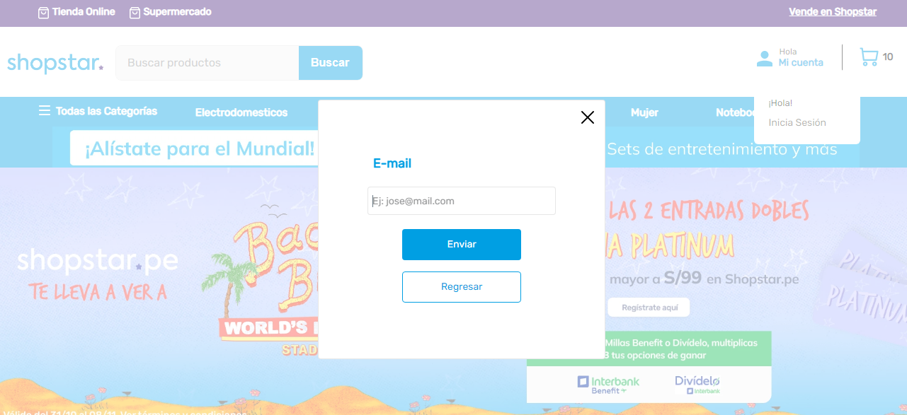
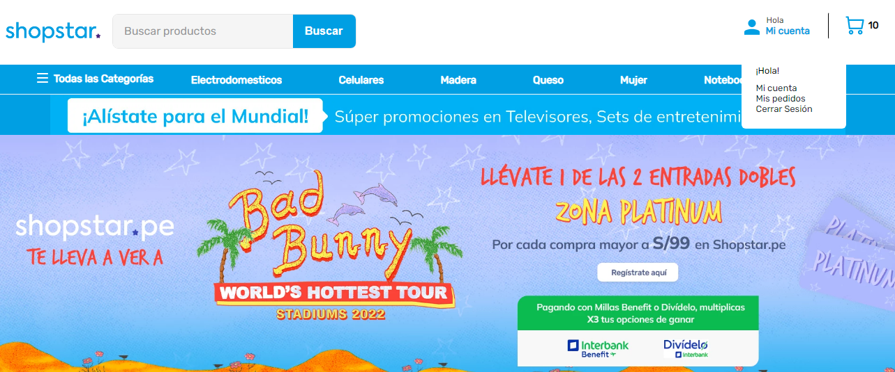

# Custom Login

El componente Login permite mostrar información del usuario siempre y cuando este logueado, si este no esta logueado mostrar el formulario de iniciar sesión.

### Usuario No Logueado


### Usuario Logueado


## Configuration 

### Paso 1 - Clonar

Para empezar, [clonar](https://github.com/cristhian-fernandez/itgloberspartnercl-custom-login) este repositorio para iniciar con la configuración básica. 
### Paso 2 - Editar 'manifest.json'

Una vez abierto el repositorio de manera local, ingresar al archivo `manifest.json` y allí es donde realizará modificaciones en los siguientes elementos: `vendor`, `name`, `version`, `title` y `description`. Como en el siguiente ejemplo:

```
{
  "vendor": "itgloberspartnercl",
  "name": "custom-login",
  "version": "0.0.1",
  "title": "Login Customizada",
  "description": "Show the Login or user information depending on whether they are logged in or not."
}
```

### Paso 3 - Revisar las dependencias y builders necesarios

Una vez modificada esa sección del `manifest.json`, se debe rectificar que el repositorio contenga las siguientes dependencias y las categories necesarios:

```
  "builders": {
    "react": "3.x",
    "messages": "1.x",
    "docs": "0.x",
    "store": "0.x"
  },
  "dependencies": {
    "vtex.css-handles": "0.x",
    "vtex.store-graphql": "2.x",
    "vtex.store-components": "3.x",
    "vtex.session-client": "1.x"
  }
```

### Paso 4 - Instalar node-modules

Se debe ubicar en la carpeta `react`, por medio de cd.. en la terminal local o desde la carpeta del proyecto, abriendo una terminal. Una vez allí, ingresar el comando: `yarn install` y se llevará adelante una instalación de las dependencias necesarias.

### Paso 5 - Ejecute un preview 

Finalmente, después de seguir los pasos anteriores, podremos ver los cambios que se han realizado, de manera local, en el entorno o workspace que se está usando. 
Para esto, debe ingresar, en su terminal, el comando: `vtex link`, donde si todo corre bien, verá el mensaje: `App linked successfully` y su componente custom estará en orden para usar. 
Si por el contrario, en su consola sale un error, lo que deberá hacer, será rectificar los pasos anteriores.

### Paso 6 - Usar componente custom en la página

Para agregar este componente custom, deberá ingresar en su proyecto, ir al archivo `manifest.json` y en `dependencies`, importar el: vendor, name y versión de este repositorio. Por ejemplo:

```
  "dependencies": {
     "itgloberspartnercl.custom-login": "0.x"
  }
```

Asi mismo en el código llamar al componente de la siguiente manera y colocar en children aquellos componentes que desea mostrar cuando el usuario va a loguearse. 

```
  {
    "menu#header-login":{
        "children": ["menu-item#header-login"]
    },
    "menu-item#header-login":{
        "props": {...},
        "blocks": ["submenu#header-login"]
    },
    "submenu#header-login":{
        "children": ["custom-login"]
    },
    "custom-login":{
        "children": ["modal-trigger#header__menu--trigger"]
    },
    "modal-trigger#header__menu--trigger":{
        "children":[
            "rich-text#header__menu--account",
            "modal-layout#header__menu--login"
        ]
    }
    ....
  }
```
## Contributors
1. Cristhian Javier Fernández Cumbia